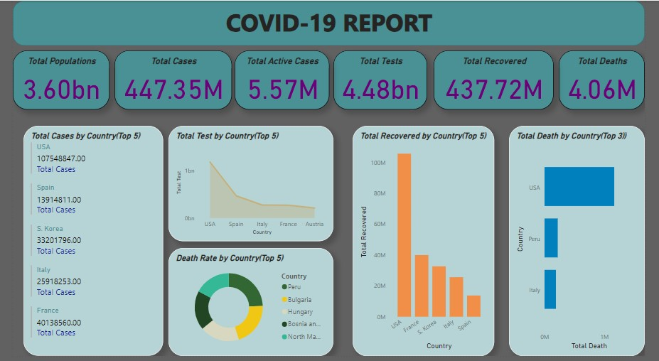
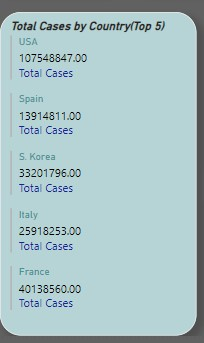
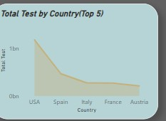
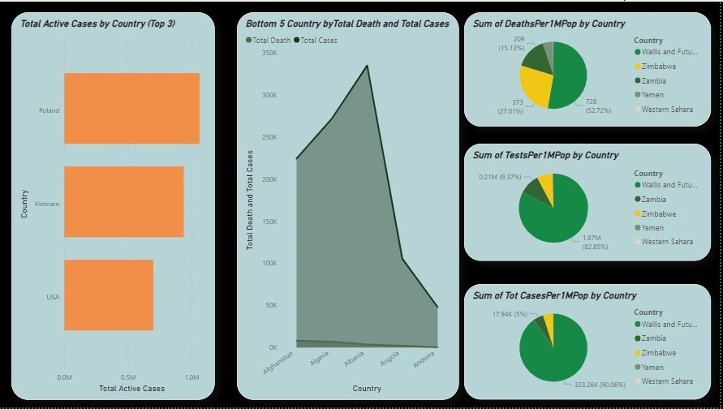

# Covid-19 Analysis

---
## Introduction

This is a power Bi project on Covid 19 analysis in the world called **Covid Cases by Country - 2023**. The project is to analyze and derive insights to answer critical questions and issues.
**_Disclaimer_**: _The dataset are gotten from kaggle just to demostrate my capabilities on Power BI._

## Problem Statement
1. What is the top 5 countries with the highest cases?
2. What is the top 5 countries with the highest death rate?
3. What is the top 5 countries with the highest test?
4. What is the top 5 countries with the highest recovered and death cases?

## Skills and concepts demonstrated:

The following Power BI features were incorporated-
_Bookmarking
_DAX
_Page navigation
_New measures
_Modelling
_Filters

## Modelling:
The dataset is just a table, so i didnt any modelling.

## Visualization

The report comprises two pages

You can interact with the report [here](https://app.powerbi.com/groups/me/reports/65579665-1ed7-4462-942e-1b00ad892f3e/ReportSection?experience=power-bi)

## Analysis

According to my analysis we can see from the images below, that the country with highest covid cases and total test is USA.

Why the country with the highest death rate is Peru.

The country with the highest recovered and death cases is USA.
Further analysis can be see in the images below

Image 1                        |     Image 2
:-----------------------------:|:------------------------:
            |   

## Conclusions
Based on the comprehensive analysis of the covid dataset, I have uncovered valuable insights into some part of the world surferring from critical impacts from the virus. These findings provide a deeper understanding of the rate at which the viruses affect individual country, regional dynamics, , and factors influencing lost of lives. The data-driven approach has allowed us to identify trends and insights.
